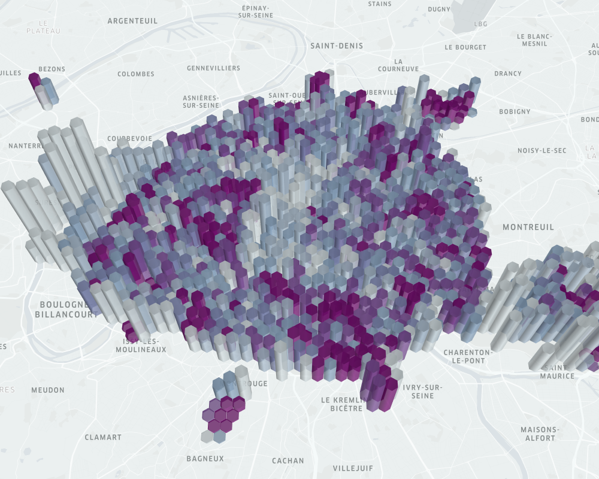

# Examples 

## Point Layer: Shipwrecks from DARMC

The first example is to plot the location and date of a number of shipwrecks around Europe. The data come from the [Digital Atlas of Roman and Medieval Civilizations](https://darmc.harvard.edu/) at Harvard.

We download the data using `Downloads` and convert it to a `DataFrame` using CSV.jl:

```julia
using KeplerGL 
using CSV, DataFrames
using ColorBrewer
using Downloads

shipwrecks_url = "https://docs.google.com/spreadsheets/d/11fk5YeQ4eFOnYSBNpUdHp4TP42gJ7wY5/gviz/tq?tqx=out:csv&sheet=GeoDatabase"

http_response = Downloads.download(shipwrecks_url);
df = CSV.File(http_response) |> DataFrame
```

We drop all shipwrecks for which we don't have geocoordinates:

```julia
dropmissing!(df, [:Latitude, :Longitude])
```

We now create the `KeplerGLMap`. We want to choose our camera position freely and therefore choose `center_map=false`. We also need a Mapbox token, which can be obtained by creating and account on [Mapbox.com](https://www.mapbox.com/). 
```julia
token = "<enter your token here>" 
m = KeplerGL.KeplerGLMap(token, center_map=false, read_only=true)
```

We then add the point layer to the map. We color the points depending on the `End_Date` and choose the radius to depend on `Width`, noting that this means that many shipwrecks with missing information will get dropped:
```julia
KeplerGL.add_point_layer!(m, df, :Latitude, :Longitude,
    color_range=parse.(Colorant, ["#00939C","#5DBABF","#BAE1E2","#F8C0AA","#DD7755","#C22E00"]),
    color_field=:End_Date,color_scale="quantize",opacity=0.5,
    radius_field = :Width, radius_fixed = false, radius_range = [10,50])
```

Finally, we add some aesthetics to the map. We choose Mapbox's `dark` theme, disable the labels on the map, and remove the legend.

```julia
# disable map legend
m.window[:map_legend_show]=false
# disable the labels on the map
m.config[:config][:mapStyle][:visibleLayerGroups][:label]=false
# use a dark basemap
m.config[:config][:mapStyle][:styleType]="dark"
```

Then we set the zoom and camera position:
```julia
m.config[:config][:mapState][:zoom] = 3.2109865005249962
m.config[:config][:mapState][:latitude] = 49.989862149983416
m.config[:config][:mapState][:longitude] = 12.118123312294815
```

Now we're ready to render and export the map to a PNG.
```julia
w = KeplerGL.render(m)
KeplerGL.export_image(w, "shipwrecks.png")
```


## Hexbin: the Trees of Paris

Our objective here is to create a hexagon plot that shows the density and average height of trees in Paris. 

First, we load a couple of packages that we need:
```julia
using KeplerGL 
using CSV, DataFrames
using ColorBrewer
```

Our data come from the Direction des Espaces Verts et de l'Environnement of the City of Paris (more info [here](https://opendata.paris.fr/explore/dataset/les-arbres/)). We download the data using the `Downloads` package (which is part of Julia's stdlib since Julia 1.6) and use CSV.jl to convert it into a `DataFrame`.
```julia
using Downloads

trees_url = "https://opendata.paris.fr/api/explore/v2.1/catalog/datasets/les-arbres/exports/csv?lang=fr&timezone=Europe%2FBerlin&use_labels=true&delimiter=%3B"
http_response = Downloads.download(trees_url);

df = CSV.File(http_response) |> DataFrame
```

The `geo_point_2d` field contains a `String` with latitude and longitude separated by a comma. Again let's use CSV.jl to separate out the two:
```julia
v= map(x -> "$x\n", df.geo_point_2d)
df2 = CSV.File(IOBuffer(string("lat,lon\n",string(v...)))) |> DataFrame
df.Latitude = df2.lat 
df.Longitude = df2.lon
```

Now we have the data ready to be plotted. First, create the `KeplerGLMap`. We want to choose our camera perspective freely, so we set `center_map=false`. We also need to have our Mapbox token ready:
```julia
token = "<enter your token here>" 
# `read_only=true` removes the button to add layers etc
m = KeplerGL.KeplerGLMap(token, center_map=false, read_only=true)
```

We want to have a nice plot without annoying buttons on the right, so we turn on 3d but turn off all buttons:
```julia
# Switch on 3d but remove the button
m.window[:toggle_3d_show] = false
m.window[:toggle_3d_active] = true
# Don't show the legend or the button for it
m.window[:map_legend_show] = false
m.window[:map_legend_active] = false
# Remove button for layers
m.window[:visible_layers_show] = false
m.window[:visible_layers_active] = false
```

Now we can create the hexbin layer. We want darker colors for a higher density of trees, and the height of the columns depending on the average height of the trees.
```julia
KeplerGL.add_hexagon_layer!(m, df, :Latitude, :Longitude,
    opacity = 0.5,
    radius = 0.2, color_range = ColorBrewer.palette("BuPu",6), color_aggregation = "average", coverage = 0.95,
    height_field = Symbol("HAUTEUR (m)"), height_scale = "linear" , height_range=[0,1000], enable_3d=true)
```

Finally, we set the camera position and angle. A nice way to get the right values is to first create the map interactively with Kepler.gl and then read off the map config values from the "export map" -> "export as JSON" menu.
```julia
m.config[:config][:mapState][:latitude] = 48.85830271617524
m.config[:config][:mapState][:longitude]= 2.338470433888891
m.config[:config][:mapState][:zoom] = 11.364401854866383
m.config[:config][:mapState][:pitch] = 30.121874231314532
m.config[:config][:mapState][:dragRotate] = true
```

Now we're ready to render the map. We'll also export the image as a PNG file. Ideally, run the export function immediately after the render, otherwise there are sometimes error messages showing up.
```julia
w = KeplerGL.render(m)

# Export the image
KeplerGL.export_image(w, "trees.png")
```


